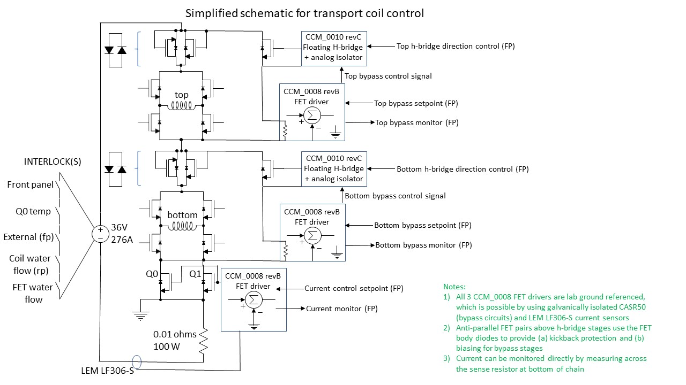

# Transport Coil Control
This is a controlling circuit for the large transport-coil pair used to tranfer CaF molecules from the MOT chamber into the dipole trap / optical tweezers chamber (and potentially also to the chip-trap chamber, the track is certainly long enough!).  We require full control of the coil pair, including the ability to switch between anti-Helmholtz and Helmholtz configurations, as well as the ability to fine tune to position of the field zero (vertically) by shunting current around the coils individually.  A simplified circuit schematic looks as follows.

Note that the connections to the 8 h-bridge FET gates are not shown.  

## Current sensor and control signal scaling/tuning
The control-voltage to output current conversion is set by adjusting the current monitor (indicator) voltage/current scaling.  The design of the FET-controlling feedback circuit CCM_0008 is such that the control voltage and monitor voltage differ by a factor of 2.  Namely, if the control voltage is 1V/A, the monitor signal will be 0.5V/A.

### Main current path/control
The LEM LF306-S current sensor is a closed-loop Hall sensor that provides a sensor current proportional to the sensed current in the ratio 1:2000.  Explicitly, a 300 A current will give an output of 150 mA.  Using a 33 ohm sense resistor, this gives a sensor voltage of 4.95V/300A.  To get the desired 1V/50A monitor scaling, we need a further gain of 1.212.  The instrumentation amplifier used in the monitor loop is the AD8226, with the gain set according to Rg (kOhms) = 49.4 kOhms / (G-1).  For our desired gain, we need a 232.8 kOhm resistor.  232 kOhms is close enough.  The resulting control voltage to output current scaling differs by a factor of 2, i.e. 1V/25A, or 25A/V.

### Bypass current path/control
The CASR50 sensors used for the two bypass circuits gives an output of 0.625V for the nominal current (50A).  We desire a monitor voltage of 1V/20A, i.e. a 50A bypass current gives a monitor voltage of 2.5V.  Thus, we want gain G = 2.5/0.625 = 4.  To get this gain for the AD8226, the gain resistor should be 16.46 kOhms.  16.5 kOhms is close enough.  The resulting bypass control voltage to output current scaling is half that of the monitor, i.e. 1V/10A, or 10A/V.  

<!-- h&theta;(x) = &theta;o x + &theta;1x -->

## Power supply remote control and monitoring
The current control box includes remote on/off, indicator leds, and signals from the Meanwell RTS-10000-36 high-current supply.  

### Connections and cabling 
The interface to the supply is achieved through three rear-panel connectors called CN991, CN992, and CN993, which are 20 pins, 10 pins, and 10 pins, respectively (HRS DF11-XYDP-2DS connectors, where XY = 10 or 20).  The signals of CN992 and CN993 are connected internally.  I've hacked a commercial DB15 cable to facilitate connecting to the power supply.  The connections are as follows:      

| RTS-10000-36 signal  | rear panel pin | Cable wire color | DB15 position |
| -------------------- | -------------- | ---------------- | ------------- |
| RC+                  | CN992 p10      | pinkish brown    | 1             |
| 12V-AUX              | CN991 p1       | red              | 2             |
| GND-AUX              | CN991 p3       | orange           | 3             |
| DC-OK2               | CN991 p4       | pink             | 4             |
| +V                   | CN991 p5       | yellow           | 5             |
| AC-FAIL2             | CN991 p8       | green            | 6             |
| -V                   | CN991 p7       | cyan             | 7             |
| OTP2                 | CN991 p9       | blue             | 8             |
| FAN-FAIL2            | CN991 p10      | light blue       | 9             |
| OTP1                 | CN991 p13      | purple           | 10            |
| DC-OK1               | CN991 p14      | grey             | 11            |
| AC-FAIL1             | CN991 p19      | white            | 12            |
| FAN-FAIL1            | CN991 p20      | black            | 13            |
| -                    | -              | brown + black    | 14            |
| -                    | -              | red + black      | 15            |
|                      |                |                  |               |

Note that the error/status signals are duplicated in two, electrically independent, channels.  Error signal X1 (e.g. fan-fail1) is a relay contact that closes to indicate failure (connects to fan-fail1-gnd).  Error signal X2 (e.g. fan-fail2) is an open-collector output that accomplishes the same functionality.  I've wired the control box in a way such that either of the two duplicated signals should trigger the indicator led (see below). 

There are also a number of connections to be made locally on the rear panel of the power supply.  Most of these simply connect the status indicator signals to system ground (GND-AUX).  The two exceptions are the output sense feedback, i.e. (CN992 p3 <--> output +) and (CN992 p5 <--> output -).  The ground connections are as follows (local brown wires daisy-chained to GND-AUX on CN991 p3).

| RTS-10000-36 signal  | rear panel pin |
| -------------------- | -------------- |
| RC-                  | CN992 p8       |
| DC-OK2-GND           | CN991 p2       |
| GND-AUX              | CN991 p3       |
| AC-FAIL2-GND         | CN991 p6       |
| OTP2-GND             | CN991 p11      |
| FAN-FAIL2-GND        | CN991 p12      |
| OTP1-GND             | CN991 p15      |
| DC-OK1-GND           | CN991 p16      |
| FAN-FAIL1-GND        | CN991 p18      |
| AC-FAIL1-GND         | CN991 p17      |
|                      |                |

### Remote on/off and interlocks 
The remote on/off control of the power supply is described in its datasheet.  Basically, RC- is connected to GND-AUX and RC+ is connected to 12V-AUX to enable the supply.  We use this as an interlock to enable/disable the supply for water flow and temperature conditions.  All of the following interlocks must be wired closed to enable the supply:

1. Rear panel BNC connector for transport coil water flow and temperature interlock.  If using a polarity-dependent interlock switch (e.g. a FET), the center pin is at higher electrical potential.

2. Front panel BNC connector for optional external interlock.  If using a polarity-dependent interlock switch (e.g. a FET), the center pin is at higher electrical potential.

3. Front panel on/off switch.

4.  Internal cooling water flow (can be manually defeated with internal jumper).  Note that the flow is directional in order to satisfy the interlock.

5. Main controlling FET (parallel pair consisting of Q0/Q1) source-terminal temperature.  Here, we use an AIRPAX normally-closed thermal switch, which opens at approximately 80 C.  

For the flow interlocks, we are currently using the Gems Sensors FS-3 (RS Components #3956940), which closes at a relatively low flow of 0.2 liters/minute.  If any of the interlock conditions are not met, the orange interlock indicator LED on the front panel should illuminate.  The interlock LED driving circuit is as follows.

### Status indicator leds/circuits
The status signals from the power supply are severly limited in terms of the available output current.  For this reason, I used these signals to drive a few basic transistor circuits that switch the front panel LED indicators on/off.  The LED-drive current itself is derived from the local 5V supply.  The four status indicators are driven by the following circuit.

To indicate a particular status is active, the supply closes an indicator relay that connects the output signal to GND-AUX.  This turns on the pnp BJT ('3906) and activates the LED.  Note that if the supply is not connected, 12V-AUX will not be present and all of the front-panel leds will be lit up.  

## Known Issues